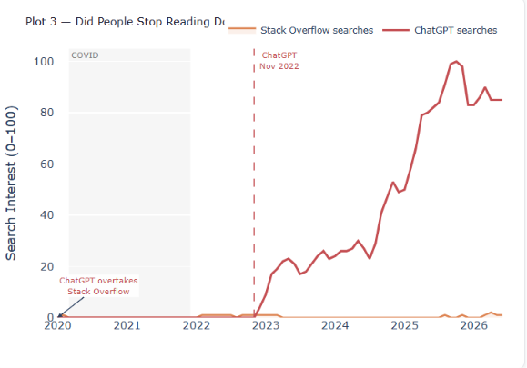
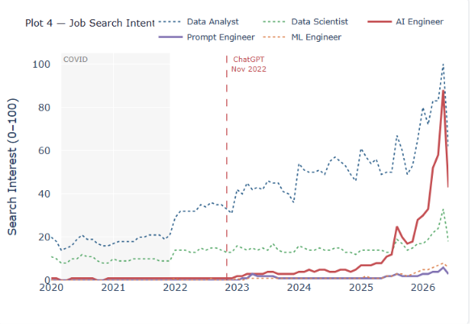
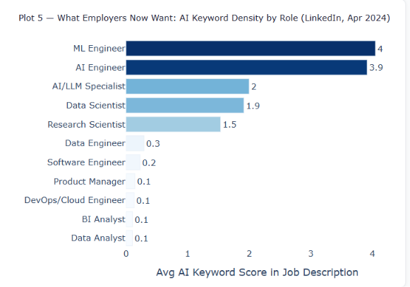
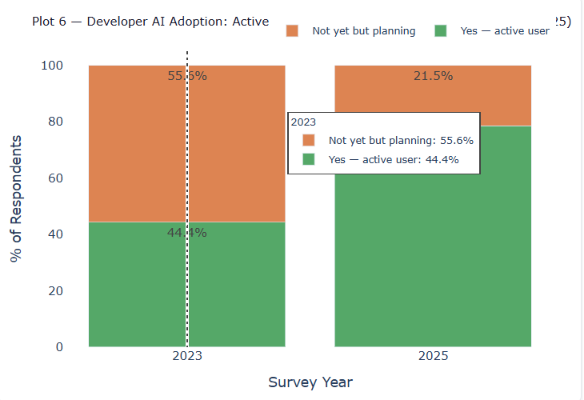

<div align="center">

# The AI Shift
### How Generative AI Reshaped Work, Skills and Information (2020–2026)

*A data-driven investigation across 5 public sources into what measurably changed after ChatGPT launched in November 2022.*


</div>

---

## What This Project Is

Most discussions about AI's impact on jobs are opinion-based. This project asks a different question: **what do the numbers actually say?**

Using five independent public datasets spanning 2020–2026, we build a before/after picture of the AI shift — in how people find information, what skills employers demand, how developers work, and what the labour market is signalling.

**Central question:** *What measurably changed after generative AI went public in November 2022?*

---

## Research Questions

How has information behaviour changed since ChatGPT?

How rapidly are developers adopting AI?

Which roles demand AI skills most?

Have traditional programming skills changed?

Can public data quantify AI's workforce impact?

## Project Highlights

<div align="center">

| | | |
|:---:|:---:|:---:|
| **138K+** | **123K+** | **5** |
| Developer Responses |    AI Job Postings   | Public Data Sources |
| **78 Months** | **8** | **15** |
|  Unified Timeline   | Interactive Analyses | Modular ETL Pipelines |

</div>

---

## Project Workflow

```
  Public Data Sources
  (Google Trends · FRED · Stack Overflow · LinkedIn · BLS)
           │
           ▼
   Data Acquisition
  (5 independent acquire scripts)
           │
           ▼
  Cleaning & Standardisation
  (per-source cleaning scripts + shared utils_clean.py)
           │
           ▼
   Feature Engineering
  (date flags · salary tiers · AI keyword scoring · role normalisation)
           │
           ▼
    Master Timeline
  (78 rows × 61 cols — one row per month, Jan 2020 – Jun 2026)
           │
           ▼
  Exploratory Analysis
  (8 hypothesis-driven analyses across all sources)
           │
           ▼
  Interactive Dashboard
  (Plotly Dash — 2 tabs, sidebar filters, live updates)
           │
           ▼
    Research Report & Interactive Insights
  (LaTeX — methodology, findings, limitations, conclusion)
```

---

## Repository Structure

```
ai-shift-analysis/
│
├── app/                    ← Plotly Dash interactive dashboard
├── data/
│   ├── raw/                ← original source files (not committed — too large)
│   └── processed/          ← cleaned parquets + master_timeline.parquet
├── src/                    ← acquire + clean + build scripts (15 total)
├── results/                ← dashboard screenshots (plot1.png – plot8.png)
├── report/                 ← final Report
└── README.md
```

---

## Dashboard Preview

<div align="center">

| | |
|:---:|:---:|
|  |  |
| *Did people stop reading docs?* | *Job search intent shifted* |
|  |  |
| *What employers now want* | *Developer AI adoption* |

</div>

The dashboard has two tabs — **Information & Interest Shift** (Google Trends analyses) and **Jobs, Skills & Economy** (LinkedIn, Stack Overflow, BLS). A live sidebar lets you filter by date range, AI keyword, job role, COVID period, and survey year — all charts update simultaneously.

---

## Key Findings

- 📈 **AI search interest went from 0 to dominant in under 24 months** — ChatGPT reached a normalised score of 100 by mid-2025 while traditional platform searches stayed flat
- 🔄 **Developer AI adoption jumped from 43.8% to 78.5%** between 2023 and 2025 — and resistance nearly vanished
- 💼 **AI Engineer overtook Data Analyst** as the most-searched tech role on Google by 2026
- 🎯 **ML Engineer and AI Engineer job descriptions contain 20–40x more AI keywords** than traditional analyst roles (LinkedIn, April 2024)
- 🛠️ **Traditional skills did not die — they grew.** Every language in the top 15 increased in developer usage from 2023 to 2025
- 💰 **Data Engineer salaries grew 37%** from 2020 to 2022, the strongest pre-ChatGPT salary signal in the dataset
- 📉 **Stack Overflow search interest was overtaken by ChatGPT** almost immediately after the November 2022 launch

---

## The 8 Analyses

| # | Analysis | Source | What it answers |
|---|---|---|---|
| 1 | The Moment Everything Changed | Google Trends | When did AI interest explode? |
| 2 | Are People Still Googling? | Google Trends | Did traditional platforms lose ground? |
| 3 | Did People Stop Reading Docs? | Google Trends | Did Stack Overflow lose to ChatGPT? |
| 4 | Job Search Intent Shifted | Google Trends | Which roles did people start searching for? |
| 5 | What Employers Now Want | LinkedIn | Which roles demand AI skills most? |
| 6 | Developer AI Adoption | Stack Overflow | How fast did developers adopt AI tools? |
| 7 | The Salary Premium | BLS | Did AI skills command higher pay? |
| 8 | The New Skill Stack | Stack Overflow | Which languages grew post-AI? |

---

## Data Sources

| Source | Coverage | Rows | What it provides |
|---|---|---|---|
| Google Trends | Jan 2020 – Jun 2026 | 78 monthly | Search interest for 25 keywords |
| FRED | Jan 2018 – May 2026 | 101 monthly | Tech employment, GDP, productivity |
| Stack Overflow Survey | 2023 & 2025 only | 138,375 respondents | Developer tools, AI adoption, salary |
| LinkedIn Job Postings | April 2024 snapshot | 123,849 postings | Employer skill demand, role distribution |
| BLS Salary Data | 2020 – 2022 | 607 observations | Pre-ChatGPT salary baseline by role |

**Master timeline:** 78 rows × 61 columns — one row per month, Jan 2020 to Jun 2026, all sources joined on date.

---

## Tech Stack

| Category | Tools |
|---|---|
| **Language** | Python 3.10+ |
| **Data Processing** | Pandas, NumPy, PyArrow |
| **Visualisation** | Plotly, Plotly Dash |
| **ETL** | Custom modular pipeline (`utils_clean.py` + 6 source-specific cleaners) |
| **Large File Handling** | Chunked streaming — LinkedIn 1.3M rows processed in 100k chunks |
| **Data Format** | Parquet (columnar, memory-efficient) |
| **Report** | LaTeX (compiled on Overleaf) |
| **Version Control** | Git, GitHub |

---

## Report

The complete methodology, data pipeline, analysis, findings, and discussion are documented in the final project report.

📄 **[AI\_Shift\_Report.pdf](report/ai_shift_report.pdf)**

---

## Installation

```bash
# 1. Clone the repository
git clone https://github.com/krishdange27/ai-shift-analysis.git
cd ai-shift-analysis

# 2. Install dependencies
pip3 install pandas pyarrow plotly dash

# 3. Run the dashboard (processed data already included)
python3 app/dash_app.py
# Open http://localhost:8050
```

**To re-run the cleaning pipeline** (requires raw source files):

```bash
python3 src/clean_google_trends.py
python3 src/clean_fred.py
python3 src/clean_analyst_jobs.py
python3 src/clean_stackoverflow.py
python3 src/clean_linkedin.py
python3 src/clean_bls_salary.py
python3 src/build_master_timeline.py
```

---

## Future Work

### 📂 Data Acquisition

- [ ] Incorporate newer Stack Overflow Developer Surveys as they become available.
- [ ] Extend the analysis with longitudinal LinkedIn and Indeed job posting datasets.
- [ ] Expand BLS salary and employment data beyond 2022.

### 📊 Analysis & Insights

- [ ] Add GitHub repository activity and developer ecosystem metrics.
- [ ] Integrate LLM adoption indicators from public APIs and usage reports.
- [ ] Develop predictive models for AI skill demand and workforce evolution.

### 🌐 Dashboard & Deployment

- [ ] Deploy the dashboard as a publicly accessible web application.
- [ ] Enhance dashboard interactivity with additional filters and export features.
- [ ] Improve mobile responsiveness and accessibility.

---

## Contributing

Contributions are welcome. Areas where help would be valuable:

- **New datasets** — additional labour market sources, international coverage, newer survey years
- **Dashboard enhancements** — new plot types, improved filters, mobile responsiveness
- **Pipeline optimisation** — faster cleaning, better memory management for large files
- **Documentation** — clearer inline comments, better docstrings across all scripts
- **Analysis extensions** — new hypotheses, deeper statistical testing

To contribute: fork the repo → create a feature branch → open a pull request with a clear description of the change.

---

<div align="center">

*The AI Shift · Krish Dange · IIT Madras · 2025*

</div>
